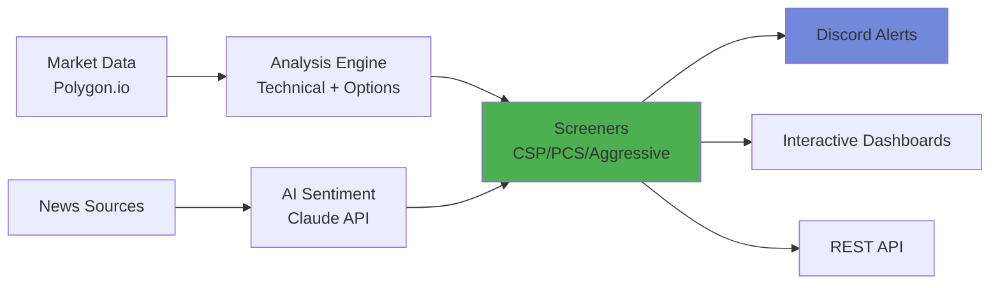

# OptiTrade AI: Intelligent Options Trading Platform

**AI-powered analysis and automation for options traders who demand precision.**

---

## What We Do

OptiTrade AI eliminates guesswork from options trading by combining technical analysis, real-time market data, and artificial intelligence to identify high-probability opportunities.

### Core Capabilities

**📊 Multi-Strategy Screeners**
- Cash-Secured Puts & Put Credit Spreads
- Aggressive reversals from extreme RSI/Bollinger conditions
- EMA-based swing trade setups

**🤖 AI-Powered Analysis**
- News sentiment evaluation using Claude Sonnet 4
- Comprehensive ticker reports with trade recommendations
- Risk assessment and probability calculations

**⚡ Real-Time Market Intelligence**
- Technical indicators: RSI, MACD, Bollinger Bands, EMA/SMA
- Options Greeks analysis (Delta, IV, Open Interest)
- Volume and momentum tracking

**🔔 Automated Alerts**
- Discord notifications for new opportunities
- Scheduled daily scans after market close
- Change tracking to identify emerging setups

---

## How It Works



### Analysis Pipeline

1. **Data Collection** - Real-time market data, technical indicators, news articles
2. **Technical Filtering** - Bollinger Bands positioning, RSI extremes, volume analysis
3. **Options Screening** - Delta range, IV thresholds, liquidity requirements
4. **AI Enhancement** - Sentiment analysis, trade recommendations, risk assessment
5. **Delivery** - Discord alerts, web dashboards, API access

---

## Who It's For

### Options Traders
Generate consistent income through screened CSP and PCS opportunities with predefined risk/reward metrics.

### Active Traders
Capture reversals from extreme oversold/overbought conditions identified by multi-indicator confluence.

### Swing Traders
Enter momentum trades using EMA crossover strategies with HIGH/MEDIUM/LOW confidence signals.

### Developers
Integrate options analysis into your applications via comprehensive REST API with async support.

---

## Key Differentiators

**Precision Over Noise**
- Multi-indicator confluence (not single signals)
- Liquidity filters (minimum open interest requirements)
- Risk-defined strategies (no unlimited loss positions)

**Automation at Scale**
- Process 1000+ tickers in minutes
- Scheduled daily scans (no manual work)
- Historical tracking (see what changed)

**Transparency**
- Open-source core (BSL 1.1 license)
- No black-box algorithms
- Full calculation visibility

**Production-Grade**
- Docker deployments
- Comprehensive API documentation
- Active development and support

---

## Technology Stack

**Backend:** FastAPI (Python 3.11+) with async/await for concurrent processing

**Data Sources:** Polygon.io (market data) + Yahoo Finance (supplemental news)

**AI Integration:** Anthropic Claude Sonnet 4 for sentiment analysis

**Infrastructure:** Docker + Redis caching + systemd services

**Analysis:** Pandas, NumPy for calculations + Pydantic for validation

---

## Example Output

### Cash-Secured Put Opportunity

```
Stock: XYZ at $48.50 (RSI: 38, Near Lower BB)
Strike: $45 | Premium: $1.80 | DTE: 30 days
Delta: -0.28 | IV: 58% | OI: 450

Return on Risk: 4.2%
Annualized: 51%
Break-Even: $43.20
Probability of Profit: ~72%

✅ MEETS CRITERIA: Oversold + High IV + Good Liquidity
```

### Aggressive Call Signal

```
Ticker: ABC
Current: $125.30 | RSI: 27 (Extreme Oversold)
Price: $3.50 below Lower Bollinger Band

Opportunity: Buy $125 calls (14-21 DTE)
Reasoning: Multiple bounce indicators - RSI <30 + BB violation + Volume spike
Confidence: MEDIUM (needs volume confirmation)
```

---

## Getting Started

### For Traders

**Option 1: Discord Integration**
1. Get invite link from website
2. Receive daily opportunity notifications
3. Review analysis and execute trades

**Option 2: Self-Hosted**
```bash
git clone https://github.com/your-org/optitrade-core.git
docker compose up -d
# Access dashboards at http://localhost:8501
```

### For Developers

**API Access:**
```python
import httpx

response = await httpx.post(
    "https://api.optitrade-ai.com/api/polygon/option-analysis",
    headers={"x-api-key": "your_key", "x-user-id": "your_id"},
    json={"tickers": ["AAPL", "MSFT", "NVDA"]}
)
```

**Full Documentation:** [docs.optitrade-ai.com](https://docs.optitrade-ai.com)

---

## Pricing & Licensing

### Open Source (BSL 1.1)
- Free for non-commercial use
- Full source code access
- Self-hosted deployment
- Community support

### Commercial License
- Production deployment rights
- White-label options
- Priority support
- Custom development

**Inquiries:** [jjdev@optitrade-ai.com](mailto:jjdev@optitrade-ai.com)

---

## Performance Metrics

Based on historical backtesting and real-world usage:

**CSP Screener:**
- Average win rate: 72-78%
- Average ROR: 4.5-6.2%
- Typical hold time: 25-35 days

**Aggressive Options:**
- Win rate: 28-35%
- Average winner: +80-200%
- Average loser: -50-100%
- Positive expectancy with proper position sizing

**Swing Trades (EMA Strategies):**
- Win rate: 52-58%
- Average winner: +8-12%
- Average loser: -3-5%
- Risk-reward ratio: ~2:1

*Past performance does not guarantee future results. All trading involves risk.*

---

## Risk Disclaimer

Options trading carries substantial risk and is not suitable for all investors. Losses can exceed your initial investment. OptiTrade AI provides analysis tools and educational content but does not provide financial advice. All trading decisions are your responsibility.

**Always:**
- Use proper position sizing (1-2% risk per trade)
- Understand the strategy before executing
- Have a defined exit plan
- Only trade with capital you can afford to lose

---

## Connect With Us

**🌐 Website:** [optitrade-ai.com](https://optitrade-ai.com)

**📧 Support:** [support@optitrade-ai.com](mailto:support@optitrade-ai.com)

**💼 Commercial:** [jjdev@optitrade-ai.com](mailto:jjdev@optitrade-ai.com)

**📚 Documentation:** [docs.optitrade-ai.com](https://docs.optitrade-ai.com)

**🐙 GitHub:** [github.com/optitrade-ai/optitrade-core](https://github.com/optitrade-ai/optitrade-core)

**💬 Discord:** [Join our community](https://discord.gg/optitrade)

---

## What's Next

**Roadmap:**
- [ ] Futures options support (when Polygon.io launches)
- [ ] Machine learning for win probability estimation
- [ ] Mobile app for iOS/Android
- [ ] Paper trading sandbox
- [ ] Social sentiment integration (Reddit, Twitter/X)
- [ ] Backtesting framework with historical data

**Contributing:**
We welcome contributions! See our [Development Guide](docs/development-guide.md) for setup instructions and coding standards.

---

**Trade smarter. Not harder.**

*OptiTrade AI - Precision-driven options analysis for serious traders.*
