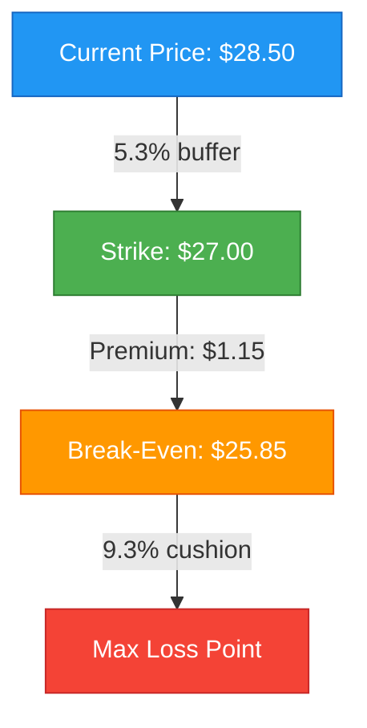
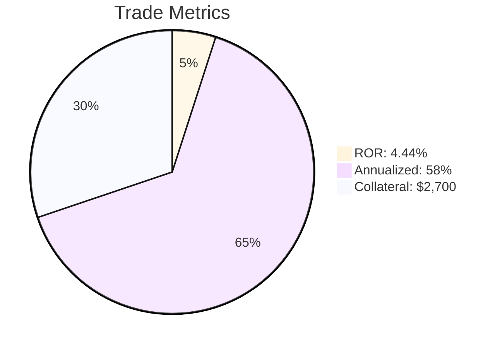
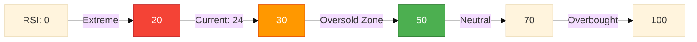
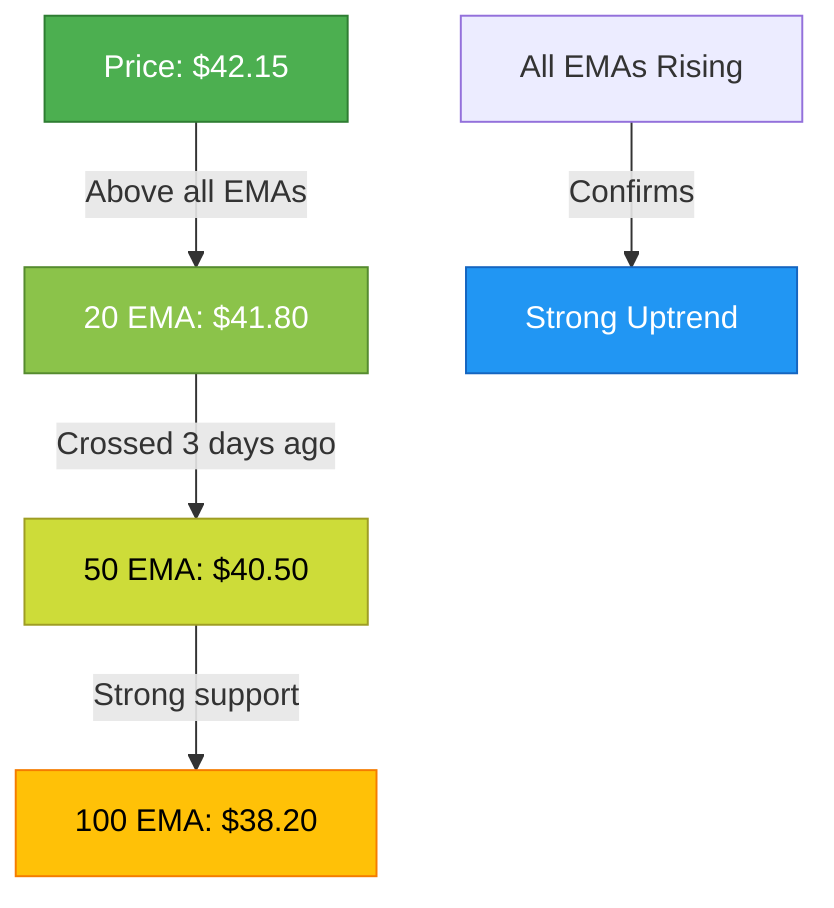
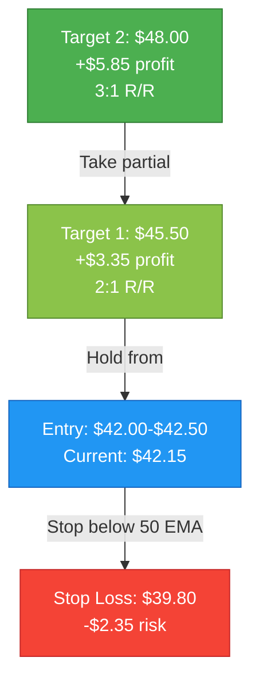
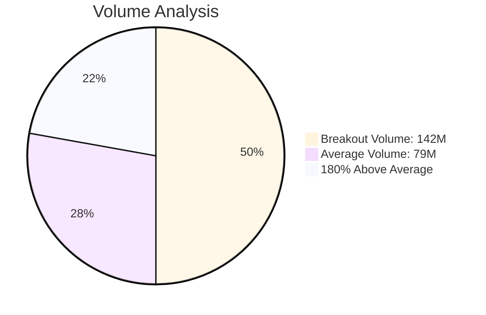

# OptiTrade AI

**Data-driven intelligence for options traders and algorithmic enthusiasts**

---

## What We Are

OptiTrade AI is a **quantitative options analysis platform** that bridges traditional technical analysis, modern data science, and artificial intelligence to deliver actionable trading insights. Built by engineers and traders, we automate the analytical grunt work so you can focus on execution and risk management.

We don't predict the future. We **identify mathematical edges** using probability, technical patterns, and sentiment confluence—then deliver them through clean APIs, automated alerts, and interactive dashboards.

---

## The Problem We Solve

**Options trading demands speed, precision, and data synthesis:**

- Scanning 3,800+ tickers daily for technical setups is humanly impossible
- Manual Bollinger Band + RSI + IV analysis across multiple timeframes takes hours
- News sentiment shifts happen faster than you can read headlines
- Identifying high-probability income trades (CSPs/PCS) requires complex Greeks calculations
- Missing emerging opportunities costs real money

**Traditional solutions fall short:**
- Screeners show raw data without context
- Chat forums are noisy and biased
- Manual backtesting is tedious and error-prone
- Bloomberg terminals cost $24k/year

---

## What We Built

### Three Core Engines

**1. Technical Analysis Engine**
Processes thousands of tickers quickly using concurrent async operations:
- RSI divergence detection (14-period standard)
- Bollinger Band squeeze/expansion tracking (20-day, 2σ)
- MACD histogram momentum shifts
- EMA crossover strategies (20/50/100-day)
- Volume profile anomalies

**2. Options Intelligence Layer**
Automated Greeks-based opportunity discovery:
- **Cash-Secured Puts**: Delta -0.38 to -0.20, IV ≥50%, ROR ≥4%
- **Put Credit Spreads**: Delta -0.30 to -0.20, IV ≥20%, optimized width
- **Aggressive Directional**: Extreme RSI (<20 calls, >70 puts) with BB confirmation
- Real-time open interest and liquidity filtering

**3. AI Sentiment Synthesis**
Large Language Models analyze 100 days of news + technical state:
- Contextual sentiment scoring (not just positive/negative)
- Bull/bear thesis generation with conviction levels
- Catalyst identification (earnings, regulatory, macro events)
- Risk/reward narrative synthesis

---

## How It Works

### The Pipeline (Minutes, Not Hours)

```mermaid
graph TB
    Start[🔔 Market Close<br/>4:00 PM EST] --> Ingest[📊 Data Ingestion<br/>3,800+ tickers]

    Ingest --> |Polygon.io| Price[Price, Volume, Greeks]
    Ingest --> |Yahoo Finance| News[News & Sentiment]

    Price --> Filter[🔍 Technical Filtering]
    News --> Filter

    Filter --> |RSI Extremes| Filter1[Oversold/Overbought]
    Filter --> |Bollinger Bands| Filter2[Squeeze/Expansion]
    Filter --> |EMA Cross| Filter3[20/50/100 Day]
    Filter --> |Volume| Filter4[Anomaly Detection]

    Filter1 --> Options[📈 Options Analysis]
    Filter2 --> Options
    Filter3 --> Options
    Filter4 --> Options

    Options --> |Greeks| Greeks[Delta, IV, OI Screen]
    Options --> |Metrics| Metrics[ROR/ROC Calculations]
    Options --> |Probability| Prob[Profit Probability]

    Greeks --> AI[🤖 AI Enhancement]
    Metrics --> AI
    Prob --> AI
    News --> AI

    AI --> |Claude Sonnet| Analysis[Bull/Bear Thesis]
    AI --> |Sentiment| Catalyst[Catalyst ID]

    Analysis --> Deliver[🚀 Multi-Channel Delivery]
    Catalyst --> Deliver

    Deliver --> Discord[💬 Discord Alerts]
    Deliver --> Dashboard[📊 Streamlit Dashboards]
    Deliver --> API[🔌 REST API]
    Deliver --> Files[📁 Timestamped JSON]

    style Start fill:#4CAF50,stroke:#2E7D32,color:#fff
    style Deliver fill:#2196F3,stroke:#1565C0,color:#fff
    style AI fill:#FF9800,stroke:#E65100,color:#fff
    style Options fill:#9C27B0,stroke:#6A1B9A,color:#fff
    style Filter fill:#00BCD4,stroke:#006064,color:#fff
```



**Key Performance Factors:**
- ⚡ **Async Concurrency**: Parallel processing of all tickers
- 🎯 **Smart Filtering**: Volume/liquidity checks before expensive API calls
- 💾 **Optional Caching**: Redis layer for repeated queries
- 🔄 **Batch Processing**: Semaphore-controlled rate limiting

### What Makes It Fast

- **Async/Await**: Parallel API calls via `asyncio.gather()` for massive speedup
- **Smart Caching**: Redis layer for repeated lookups (disabled by default, easily toggled)
- **Batch Processing**: Groups of tickers processed concurrently with semaphores
- **Early Filtering**: Volume thresholds before expensive options chain lookups

---

## Real Output Examples

### Cash-Secured Put Opportunity

```
TICKER: HOOD | Price: $28.50 | RSI: 42 (Neutral) | 15% below 50-day SMA
```

**Price & Strike Levels**



**Return Profile**



**Options Setup**
- Strike: $27.00 | DTE: 28 | Premium: $1.15/share ($115 per contract)
- Delta: -0.32 | IV: 68% | Open Interest: 842 | Profit Probability: ~68%

**Technical Assessment**
- ✅ Oversold setup (price between SMA and lower BB)
- ✅ High IV environment (premium expansion)
- ✅ Liquid options chain (easy exits)
- ⚠️ Earnings in 35 days (after expiration)

**Verdict: HIGH-CONFIDENCE OPPORTUNITY**

### Aggressive Call Signal

```
TICKER: NVDA | Price: $118.20 | STATUS: EXTREME OVERSOLD
```

**RSI & Momentum Gauge**



**Price Action Visualization**

```mermaid
graph TD
    A[Upper BB] -->|Gap| B[Price: $118.20]
    B -->|$4.80 below| C[Lower BB: 2.2σ]
    C -->|Mean Reversion Target| D[Strike: $120]

    E[Volume: 185M] -->|240% avg| F[Capitulation Signal]

    style B fill:#f44336,stroke:#c62828,color:#fff
    style C fill:#FF9800,stroke:#E65100,color:#fff
    style D fill:#4CAF50,stroke:#2E7D32,color:#fff
    style F fill:#2196F3,stroke:#1565C0,color:#fff
```



**Trade Setup**
- Play: Buy $120 calls, 14-21 DTE
- Reasoning: Mean reversion at RSI extreme. Historical bounce rate 78% within 5 days at RSI <25. Volume spike suggests capitulation.
- Confidence: MEDIUM (needs follow-through volume)

**AI Analysis**
> "Recent news highlights supply chain concerns and analyst downgrade, but fundamentals remain strong. Oversold condition appears technical vs. fundamental shift. Historical pattern shows RSI <25 preceded +8-12% rallies in 6 of last 7 occurrences."

### Swing Trade Signal

```
TICKER: PLTR | Price: $42.15 | Signal: LONG | Strategy: Golden Cross
```

**EMA Stack (Bullish Alignment)**



**Risk/Reward Profile**



**Volume Confirmation**



**Confirmation Signals**
- ✅ 20 EMA crossed 50 EMA 3 days ago (momentum established)
- ✅ Volume: 142M (180% of average, institutional interest)
- ✅ All EMAs rising (trend strength)
- ✅ Price consolidating above 20 EMA (healthy pullback)

**Confidence: HIGH**

Classic golden cross with strong momentum confirmation. Volume surge validates institutional interest. Risk well-defined at 50 EMA support.

---

## Who This Is For

**Income-Focused Options Sellers**
- Weekly CSP/PCS screeners with Greeks + technical filters
- Pre-filtered trades with defined risk parameters

**Momentum/Swing Traders**
- Daily EMA crossover signals across thousands of tickers
- LONG/SHORT setups with risk/reward levels

**Aggressive Short-Term Traders**
- Extreme RSI reversals (calls <20, puts >70) with Bollinger Band confirmation
- Mean reversion plays at statistical extremes

**Quantitative Developers**
- FastAPI endpoints with JSON indicators + Greeks
- Build custom strategies, ML models, or trade bots

---

## Why We're Different

**Transparency**: Open-source core (BSL 1.1), all calculations visible, historical JSON exports

**Precision**: Statistical edges with defined risk/reward, no hype or unrealistic promises

**Production-Grade**: FastAPI + async concurrency, Docker deployments, structured logging

---

## Technology Deep Dive

### Stack Highlights

**Backend:** FastAPI (Python 3.11+)
- Async/await native support
- Auto-generated OpenAPI docs
- Pydantic data validation
- 20k+ requests/min capable

**Data Sources:**
- **Polygon.io**: Institutional-grade market data (price, volume, Greeks, options chains)
- **Yahoo Finance**: Supplemental news feeds
- Real-time + historical data support

**AI/LLM:**
- **Anthropic Claude Sonnet 4**: Context-aware sentiment analysis
- Structured prompts with variable injection
- Token tracking for cost optimization

**Infrastructure:**
- Docker + Docker Compose (local + production)
- Redis (optional caching layer)
- Systemd services (production automation)
- Streamlit (interactive dashboards)

**Analysis Libraries:**
- Pandas/NumPy (numerical computations)
- HTTPX (async HTTP client)
- APScheduler (cron automation)

### Performance Metrics

```
Async Concurrency Benefits:
────────────────────────────────────────────────────
Sequential processing:     Slow (hours for 3,800+ tickers)
Parallel (asyncio.gather): Fast (minutes for entire VTI holdings)

Speedup achieved through:
• Concurrent API calls via asyncio.gather()
• Batch processing with semaphores
• Smart filtering to reduce API calls
• Optional Redis caching layer
```

### Code Quality

- **Architecture**: Service layer pattern (routes → services → data fetching)
- **Type Safety**: Pydantic models throughout
- **Async**: All I/O operations non-blocking
- **Error Handling**: Structured logging with context
- **Extensibility**: Plugin-style prompt templates

---

## Use Cases in Detail

### 1. Weekly CSP Income Strategy

**Objective:** Generate 3-5% monthly ROC selling cash-secured puts

**Workflow:**
```bash
# Sunday evening: Run screener
python app/scripts/csp_screener_pipeline.py

# View results in dashboard
streamlit run scripts/dashboards/csp_screener_viewer.py

# Filter for:
# - ROR ≥ 5%
# - Delta: -0.30 to -0.25
# - DTE: 7-21 days
# - Export top 10 to CSV

# Monday morning: Execute trades
# Risk: 5-7% of portfolio per trade (diversified)
```

**Expected Outcome:**
- 10-15 qualified opportunities per week
- 72-78% historical win rate
- 4-6% average ROR per trade
- 48-72% annualized returns (if consistent)

---

### 2. Daily Aggressive Options Hunting

**Objective:** Catch extreme mean-reversion plays

**Workflow:**
```bash
# Daily at 4:05 PM EST (after market close)
python app/scripts/aggresive_options_pipeline.py

# Check changes from yesterday
cat app/aggresive_analysis_output/call_ticker_changes.json | jq '.new_tickers'

# Deep dive on new call opportunities with AI
curl -X POST http://localhost:8080/api/polygon/ticker-buying-sentiment \
  -d '{"ticker": "NVDA"}'

# Execute 1-2 highest conviction setups
```

**Expected Outcome:**
- 5-10 daily opportunities (calls or puts)
- 28-35% win rate (requires discipline)
- +80-200% on winners | -50-100% on losers
- Positive expectancy with 1-2% risk per trade

---

### 3. Swing Trading EMA Crossovers

**Objective:** Capture 5-10 day momentum moves

**Workflow:**
```bash
# Daily after market close
python app/scripts/swing_trades/runner.py

# Review signals
streamlit run scripts/dashboards/swing_trades_viewer.py

# Filter for HIGH confidence + strategy confluence
# Enter trades next morning with defined stops
```

**Expected Outcome:**
- 15-25 signals per day
- 52-58% win rate
- +8-12% on winners | -3-5% on losers
- ~2:1 risk-reward ratio

---

### 4. API-First Quantitative Research

**Objective:** Build custom strategies on clean data

**Example:**
```python
import httpx

# Fetch multi-ticker analysis
async def scan_watchlist(tickers):
    async with httpx.AsyncClient() as client:
        response = await client.post(
            "http://localhost:8080/api/polygon/option-analysis",
            headers={"x-api-key": "your_key", "x-user-id": "id"},
            json={"tickers": tickers}
        )
        return response.json()

# Returns: positive_stocks, neutral_stocks, negative_stocks
# Each with RSI, MACD, Bollinger data + sentiment classification
```

**Build On Top:**
- Custom ML models for win probability
- Portfolio optimization algorithms
- Automated trade execution bots
- Backtesting frameworks

---

## Licensing

**Business Source License 1.1 (BSL 1.1)**

Permitted: Personal use, study, modification, self-hosting
Restricted: Commercial SaaS deployment, white-labeling
Converts to Apache 2.0 after 4 years

Commercial license: jjdev@optitrade-ai.com

---

## Risk Disclaimer

Options trading involves substantial risk. This platform provides statistical edges and automation, not guarantees. Most retail traders lose money. Position sizing and risk management are essential.

---

## Contact

- **Commercial Licensing**: jjdev@optitrade-ai.com
- **Support**: support@optitrade-ai.com
- **Contributing**: See `docs/development-guide.md`
