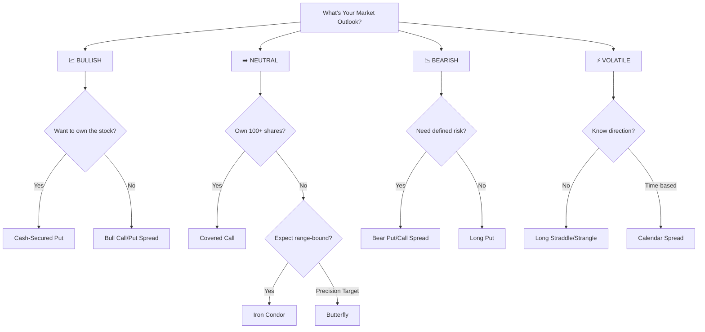

# 📊 OptiTrade AI
*Master Options Trading with Visual Clarity*

---

## 🎯 Quick Navigation

[**Beginner Strategies**](#-beginner-friendly-strategies) • [**Spreads**](#-spread-strategies) • [**Advanced**](#-advanced-strategies) • [**Strategy Selector**](#-strategy-selector-tool) • [**Risk Guide**](#-risk-management-essentials)

---

## 📈 Strategy Overview Dashboard

### 🟢 Beginner-Friendly Strategies
Perfect for those starting their options journey

| Strategy | **Cash-Secured Put** | **Covered Call** |
|:---------|:---------------------|:-----------------|
| **🎯 Goal** | Buy stock at discount | Generate income on holdings |
| **📊 Market View** | Bullish to Neutral | Neutral to Slightly Bullish |
| **⚠️ Risk Level** | Medium | Medium |
| **💰 Max Profit** | Premium received | Premium + appreciation |
| **🔒 Capital Need** | 100 × Strike price | 100 shares owned |
| **⏰ Best Time** | High IV, before support | Range-bound markets |

### 🔷 Spread Strategies
Defined risk with clear profit targets

| Strategy | **Bull Put Spread** | **Bull Call Spread** | **Bear Call Spread** | **Bear Put Spread** |
|:---------|:-------------------|:---------------------|:---------------------|:-------------------|
| **📈 Direction** | ⬆️ Bullish | ⬆️ Bullish | ⬇️ Bearish | ⬇️ Bearish |
| **💵 Entry** | Credit | Debit | Credit | Debit |
| **🎯 Best When** | Above support | Breakout expected | Below resistance | Breakdown expected |
| **Risk:Reward** | 1:1 typical | 1.5:1 typical | 1:1 typical | 1.5:1 typical |

### 🔮 Advanced Strategies
Complex multi-leg positions for experienced traders

| Strategy | **Iron Condor** | **Butterfly** | **Straddle** | **Strangle** | **Calendar Spread** |
|:---------|:---------------|:--------------|:-------------|:-------------|:-------------------|
| **🎭 Complexity** | High (4 legs) | High (3 legs) | Medium (2 legs) | Medium (2 legs) | Medium (2 legs) |
| **📐 Shape** | Range profit | Peak profit | V-shaped | V-shaped (wider) | Time-based |
| **💎 Ideal For** | Low volatility | Precision target | Big moves | Bigger moves | Theta harvest |

---

## 💡 Strategy Selector Tool

### **"What Strategy Should I Use?"**



---

## 🎓 Beginner-Friendly Strategies

### 1️⃣ **Cash-Secured Put** 💰
*Generate income while potentially buying stock at a discount*

#### Visual P&L Profile
```
Profit ↑
      │    ═══════════════════════► Premium Kept ($200)
  $200├────┐
      │    │
    $0├────┼────────────────────────► Stock Price
      │    │ ← Breakeven ($43)
 -$300├────┘
      │
      └────┴────┴────┴────┴────┴────
          $40  $43  $45  $48  $50
               BE  Strike
```

#### **Real Example Trade**
```
📊 AAPL Trading at $150
━━━━━━━━━━━━━━━━━━━━━
✍️ SELL 1 Put @ $145 strike
💵 Collect $3.00 premium ($300)
🏦 Cash Required: $14,500
📍 Breakeven: $142
━━━━━━━━━━━━━━━━━━━━━
```

**📈 Three Possible Outcomes:**
1. **Stock stays above $145** → Keep $300 (2.1% return in 30 days) ✅
2. **Stock falls to $142-145** → Own AAPL at discount, partial profit 🔄
3. **Stock falls below $142** → Own AAPL, temporary loss ⚠️

#### **🎯 Pro Tips**
- ✅ Sell puts on stocks you'd buy anyway
- ✅ Use 30-45 DTE for optimal premium
- ✅ Target 1-2% monthly returns
- ❌ Don't chase premium on bad stocks
- ❌ Avoid before earnings unless prepared

---

### 2️⃣ **Covered Call** 📈
*Turn your stock holdings into an income machine*

#### Visual P&L Profile
```
Profit ↑         ═══════════════► Capped at $650
      │       ╱
  $650├──────┘   
      │     ╱ ← Stock + Premium  
  $150├────┘  
      │   ╱
    $0├──┴──────────────────────► Stock Price
      │ ╱
 -$500├┘ ← Downside (offset by premium)
      │
      └────┴────┴────┴────┴────┴
          $45  $48  $50  $55  $60
               BE  Cost Strike
```

#### **Monthly Income Calculator**
| Shares Owned | Strike Above Cost | Premium/Month | Annual Income |
|:-------------|:------------------|:--------------|:--------------|
| 100 | $5 (10%) | $150 | $1,800 |
| 500 | $5 (10%) | $750 | $9,000 |
| 1000 | $5 (10%) | $1,500 | $18,000 |

---

## 🎯 Spread Strategies

### **Bull Put Spread** 🐂
*Defined risk bullish play with credit entry*

#### The Setup Visualized
```
     SELL PUT           BUY PUT
        ↓                 ↓
    ┌────────┐        ┌────────┐
    │ $48    │        │ $45    │
    │ +$2.00 │        │ -$0.50 │
    └────────┘        └────────┘
         ╲              ╱
          ╲            ╱
           ╲          ╱
         Net Credit: $1.50
         Max Risk: $1.50
         Risk/Reward: 1:1
```

#### **Probability Zones**
```
Stock Price Scale
$44    $45    $46    $47    $48    $49    $50
 │      │      │      │      │      │      │
 ▼      ▼      ▼      ▼      ▼      ▼      ▼
[■■■■■■|■■■■■■■|░░░░░░░|▓▓▓▓▓▓▓|▓▓▓▓▓▓▓|▓▓▓▓▓▓▓]
  Max     Loss    Break    Profit Zone (70% probability)
  Loss    Zone    Even
```

### **Iron Condor** 🦅
*The premium seller's favorite - profit from time decay*

#### Four-Leg Architecture
```
        PUT SIDE                    CALL SIDE
    ╔═══════════════╗          ╔═══════════════╗
    ║  Buy $42 Put  ║          ║  Buy $58 Call ║
    ║    -$0.30     ║          ║    -$0.30     ║
    ╚═══════╤═══════╝          ╚═══════╤═══════╝
            │                           │
    ╔═══════╧═══════╗          ╔═══════╧═══════╗
    ║ Sell $45 Put  ║          ║ Sell $55 Call ║
    ║    +$1.00     ║          ║    +$1.00     ║
    ╚═══════════════╝          ╚═══════════════╝
    
    Net Credit: $1.40 │ Max Risk: $1.60 │ Return: 87.5%
```

#### **Profit Zone Map**
```
Stock Price:  $40    $43.6   $45    $50    $55    $56.4   $58    $60
              │       │       │      │      │       │      │      │
P&L:       -$160     $0    +$140  +$140  +$140     $0   -$160  -$160
              ▼       ▼       ▼      ▼      ▼       ▼      ▼      ▼
Status:    [LOSS] [B.E.] [═══PROFIT ZONE═══] [B.E.] [LOSS]
Probability:  5%     10%          70%          10%     5%
```

---

## 🔮 Advanced Strategies

### **Long Straddle** ⚡
*Profit from big moves in either direction*

#### Earnings Play Visualization
```
        Pre-Earnings Setup
    ┌─────────────────────────┐
    │   Buy $50 Call: -$3.00  │
    │   Buy $50 Put:  -$3.00  │
    │   Total Cost:   -$6.00  │
    └─────────────────────────┘
                ↓
         Needs 12% Move
    ┌───────────┴───────────┐
    ↓                       ↓
Move Down 12%+          Move Up 12%+
Stock → $44             Stock → $56
Profit: Unlimited       Profit: Unlimited
```

#### **Historical Earnings Moves** (Example)
```
Quarter    Expected Move    Actual Move    Straddle Result
━━━━━━━━━━━━━━━━━━━━━━━━━━━━━━━━━━━━━━━━━━━━━━━━━━━━━━
Q1 2024    ±8%             +15% 🚀        +$900 profit
Q2 2024    ±10%            -3% 😐         -$450 loss
Q3 2024    ±9%             -18% 🚀        +$1,200 profit
Q4 2024    ±7%             +2% 😐         -$500 loss
━━━━━━━━━━━━━━━━━━━━━━━━━━━━━━━━━━━━━━━━━━━━━━━━━━━━━━
```

### **Butterfly Spread** 🦋
*Low-cost, high-reward precision play*

#### The Butterfly Structure
```
         Perfect Butterfly Shape at Expiration
    
    P&L ↑    
        │         ╱╲
    $350├────────╱──╲──────── Max Profit
        │       ╱    ╲
        │      ╱      ╲
      $0├─────╱────────╲─────
        │    ╱          ╲
   -$150├───╱────────────╲─── Max Loss
        │  ╱              ╲
        └──┴───┴───┴───┴───┴─→ Stock Price
          $45 $47.5 $50 $52.5 $55
          
    Wings: Buy $45 & $55    Body: Sell 2× $50
```

---

## 📊 Risk Management Essentials

### **Position Sizing Formula**
```
                Account Size × Risk %
Max Position = ─────────────────────
                  Max Loss Per Trade

Example: $10,000 × 2% = $200 max risk per trade
```

### **The 5 Golden Rules** 🏆

1. **Never risk more than 2% per trade**
   ```
   $10,000 account → Max $200 risk
   $50,000 account → Max $1,000 risk
   ```

2. **Set stops at strategy breakeven**
   ```
   Credit Spread collected $150
   Stop loss at: Spread width - Credit
   ```

3. **Diversify across sectors**
   ```
   ✅ Tech (20%) + Healthcare (20%) + Finance (20%)
   ❌ All tech stocks (100%)
   ```

4. **Scale position size with volatility**
   ```
   High IV (>50%) → Smaller size
   Low IV (<30%) → Normal size
   ```

5. **Always have an exit plan**
   ```
   Profit Target: 50% of max profit
   Stop Loss: 2× credit received
   Time Stop: 21 DTE roll or close
   ```

---

## 📈 Greeks Quick Reference Card

### **The Big 5 Greeks Explained**

| Greek | **What It Measures** | **Good to Know** | **Visual Aid** |
|:------|:--------------------|:-----------------|:---------------|
| **Δ Delta** | Price movement | 0.50 delta = 50% chance ITM | `Stock ↑$1 → Option ↑$0.50` |
| **Θ Theta** | Time decay | Accelerates near expiration | `📅 30 days: -$0.05/day`<br>`📅 7 days: -$0.20/day` |
| **Γ Gamma** | Delta change rate | Highest ATM | `Delta accelerates as ITM increases` |
| **V Vega** | Volatility impact | Long = wants IV ↑ | `IV ↑10% → Option ↑$0.30` |
| **ρ Rho** | Interest rate impact | Usually negligible | `Rates ↑1% → Call ↑$0.05` |

---

## 🚀 Getting Started Action Plan

### **Week 1-2: Foundation**
- [ ] Open paper trading account
- [ ] Master calls vs puts mechanics
- [ ] Understand ITM/ATM/OTM
- [ ] Practice reading option chains

### **Week 3-4: First Strategy**
- [ ] Start with cash-secured puts
- [ ] Paper trade 5 positions
- [ ] Track P&L and mistakes
- [ ] Review each trade's outcome

### **Month 2: Expand**
- [ ] Add covered calls (if own stock)
- [ ] Try one spread strategy
- [ ] Keep position size small (1-2%)
- [ ] Join options trading community

### **Month 3: Refine**
- [ ] Develop personal trading rules
- [ ] Create watchlist of 10-15 stocks
- [ ] Set weekly/monthly goals
- [ ] Review and adjust strategy

---

## 🎯 Performance Tracking Template

### **Monthly Review Dashboard**
```
Month: _________    Starting Capital: $________

━━━━━━━━━━━━━━━━━━━━━━━━━━━━━━━━━━━━━━━━━
Strategy         Trades    Win%    P&L
━━━━━━━━━━━━━━━━━━━━━━━━━━━━━━━━━━━━━━━━━
Cash-Secured Put   [ ]     [ ]%    $[ ]
Covered Call       [ ]     [ ]%    $[ ]
Bull Put Spread    [ ]     [ ]%    $[ ]
Iron Condor        [ ]     [ ]%    $[ ]
━━━━━━━━━━━━━━━━━━━━━━━━━━━━━━━━━━━━━━━━━
TOTAL:            [ ]     [ ]%    $[ ]
━━━━━━━━━━━━━━━━━━━━━━━━━━━━━━━━━━━━━━━━━

Best Trade: _________________ (+$____)
Worst Trade: ________________ (-$____)
Lessons Learned: _____________________
```

---

## 💎 Pro Tips from Experienced Traders

### **"The Wisdom Collection"**

> 🎯 **"Sell premium when IV rank > 50th percentile"**
> High IV = expensive options = better for selling

> ⏰ **"45 DTE entry, 21 DTE exit or roll"**
> Sweet spot for theta decay acceleration

> 📊 **"Take profits at 50% of max"**
> Don't be greedy - consistent base hits beat home runs

> 🛡️ **"Never sell naked - always define your risk"**
> Undefined risk strategies can blow up accounts

> 📈 **"Trade the same underlyings repeatedly"**
> Master 5-10 stocks rather than chase 100

---

## ⚠️ Critical Risk Warning

**OPTIONS TRADING RISKS:**

- 🔴 **100% loss possible** on long options
- 🔴 **Unlimited loss possible** on naked positions  
- 🔴 **Assignment can happen** anytime before expiration
- 🔴 **Volatility can change** rapidly and unexpectedly
- 🔴 **Liquidity issues** in some strikes/expirations

**Before You Trade:**
1. Understand maximum loss potential
2. Have sufficient capital reserves
3. Know your broker's margin requirements
4. Understand tax implications
5. Never trade with money you can't afford to lose

---

## 📚 Resources & Tools

### **Essential Tools**
- **Options Chains:** Your broker platform
- **IV Rank/Percentile:** Market Chameleon, TastyWorks
- **Profit Calculator:** OptionsProfitCalculator.com
- **Greeks Viewer:** Your broker or OptionStrat
- **Screeners:** Barchart, FinViz

### **Education Path**
1. **Start Here:** CBOE Options Institute
2. **Video Learning:** TastyTrade, OptionAlpha
3. **Books:** "Options as a Strategic Investment" - McMillan
4. **Practice:** Paper trade for 3+ months
5. **Community:** r/options, Elite Trader

---

## 🎯 Final Thoughts

**Success in options = Risk Management + Patience + Continuous Learning**

Remember:
- 📍 Start small, scale slowly
- 📍 Focus on consistent singles, not home runs
- 📍 Protect capital above all else
- 📍 Learn from every trade, win or lose
- 📍 The market will always be there tomorrow

---

*📊 OptiTrade AI - Your Intelligent Options Trading Companion*

*Last Updated: October 2025 | Version 2.0 Enhanced*
